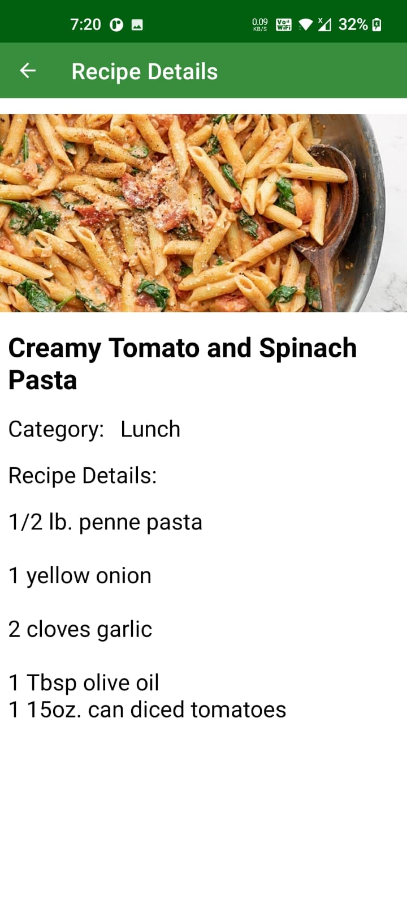
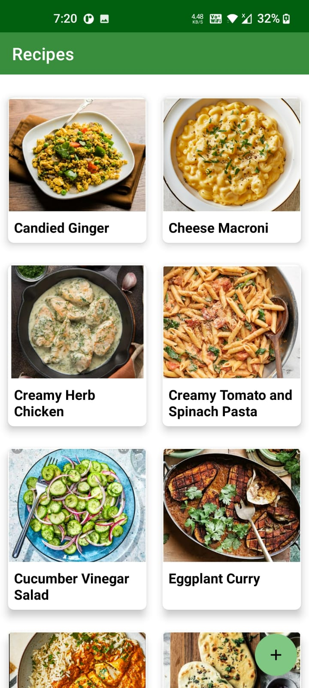
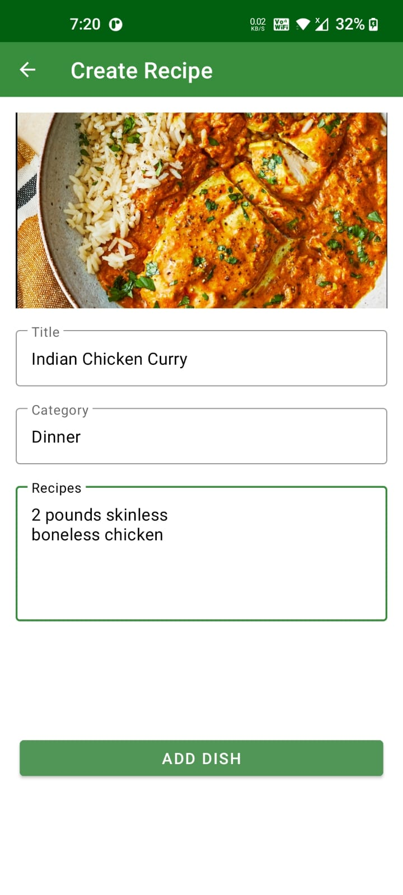

# RecipeCreator
This repo contains a Kotlin application called Recipe creator you can 

## TechStack Used

* Firebase Firestore is used for databse .
* Recycler View is used.
* Kotlin is used as the backend language.
* Glide and many other libraries are also used.

 <a href="https://firebase.google.com/" target="_blank"> 

## What does it do?

* You can create a Recipe and then that recipe will be stored in the firebase and gets display in the Main screen.
* The recipes are clickable and you can get the details of the recipe by clicking on it.

## Screenshots

## Contributing

Contrtibutions are welcome. Go ahead and fork this repo and create a pull request. Currently you can contribute by adding new features or fixing bugs.
